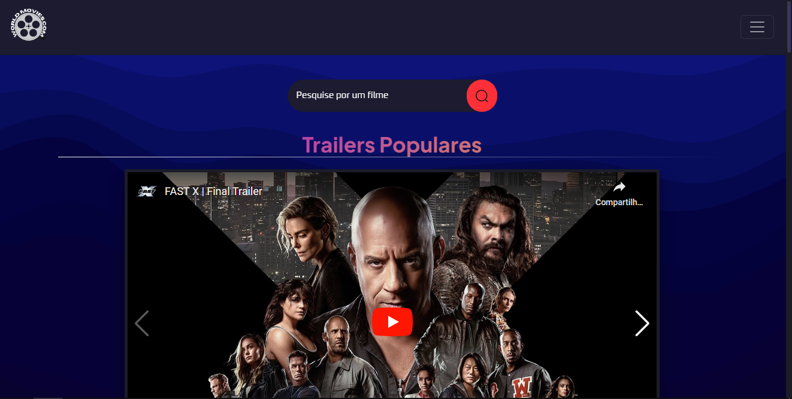

   

### Tópicos 

- [Descrição do projeto](#descrição-do-projeto)

- [Funcionalidades](#funcionalidades)

- [Ferramentas utilizadas](#ferramentas-utilizadas)

- [Link do deploy realizado](#Link do deploy realizado)

- [Abrir e rodar o projeto](#abrir-e-rodar-o-projeto)

- [Desenvolvedor](#desenvolvedor)

## Descrição do projeto 

World Movies é um site construído utilizando a API do TMDB, onde você pode criar sua lista de filmes para assistir, buscar por filmes e conferir as últimas estreias. Com um design moderno e uma interface fácil de usar, o World Movies oferece uma experiência de navegação sem complicações para os amantes de cinema e entusiastas de filmes. Seja você fã de clássicos atemporais ou esteja ansioso para explorar as mais recentes novidades, este site é perfeito para você. Aprimore sua jornada de assistir filmes com o World Movies e descubra um mundo de maravilhas cinematográficas ao seu alcance.

## funcionalidades

:heavy_check_mark: `Funcionalidade 1:` Buscar filmes 

:heavy_check_mark: `Funcionalidade 2:` Ver os trailers e filmes populares, em cartaz e mais bem avaliados

:heavy_check_mark: `Funcionalidade 3:` Adiciona-los a uma watchlist 

:heavy_check_mark: `Funcionalidade 4:` Filtrar filmes por categorias

## Aplicação

  

  

###

## ferramentas-utilizadas

 &nbsp;
  &nbsp;
  &nbsp;
  &nbsp;

###

## Link do deploy realizado

  <a href="https://worldmovies-gamma.vercel.app">Clique aqui para ser redirecionado</a>

## Desenvolvedores

| [ Murilo Barbosa](https://github.com/Murilo358) 
